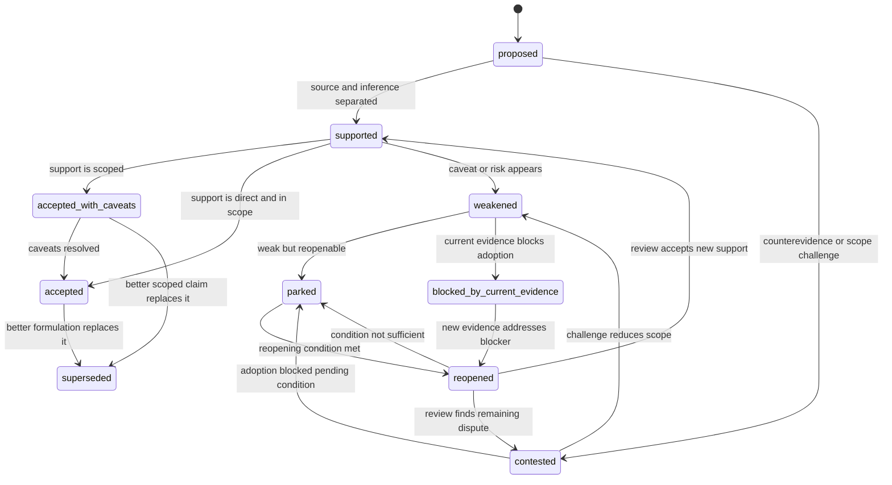

# Claim Lifecycle Model

Epistemic Audit Graph treats contested claims as states that can be downgraded, parked, reopened, accepted with caveats, or superseded without deleting the audit trail.

The first demos teach a small path. The full model keeps additional states for validation, review, and implementation.

## Core States

These are the states a first-time reader should understand first.

| State | Meaning | User-facing question |
| --- | --- | --- |
| `proposed` | A claim has entered the graph. | What exactly is being claimed? |
| `contested` | The claim has support and challenge pressure. | Which evidence, counterevidence, or source reading is disputed? |
| `parked` | The claim is not accepted, but not deleted. | What conditions would reopen it? |
| `reopened` | New evidence or clarification has met a stated reopening condition. | Does review move it up, keep it parked, or downgrade it again? |
| `accepted` | The claim is accepted within stated scope and caveats. | What caveats and falsifiers remain visible? |

## Advanced States

These states are useful in the dashboard, validator output, and deeper graph demos.

| State | Meaning | Why it exists |
| --- | --- | --- |
| `supported` | Evidence supports the claim within some scope. | Separates support from final acceptance. |
| `weakened` | New evidence or a source audit reduces confidence or scope. | Shows non-destructive downgrade before parking or rejection. |
| `blocked-by-current-evidence` | Current evidence blocks adoption of the claim. | Softer public label for the older internal `failed_by_current_evidence` value. |
| `accepted-with-caveats` | The claim is usable only with explicit limitations. | Prevents scoped claims from being flattened into stronger claims. |
| `superseded` | A better formulation or newer claim replaces the old one. | Keeps the old state auditable without keeping it active. |

## State Diagram



## Parked Versus X-Tier

`parked` is a lifecycle state.

`X` is an audit-tier warning: the current wording is a parked overclaim, or it is blocked by current evidence.

Many `X` claims should be `parked`, but the two labels answer different questions.

| Label | Answers | Example |
| --- | --- | --- |
| `parked` | What is the claim's lifecycle state? | The claim is visible but not accepted. |
| `X` | How should the support structure be displayed? | The current wording overclaims what the source can support. |

A parked claim must include the reason it is parked and the condition that would reopen it. A bare red label is not enough.

## Park-Condition Propagation

The core rule is that a claim inherits not only support from its evidence, but also conditions and uncertainty from the evidence and the inference edge.

```text
Evidence E has condition C1
Inference E -> Claim X adds assumption C2
Claim X inherits C1 and adds C2

X park conditions = C1 + C2
```

This explains why real evidence can still produce an overclaim.

```text
Evidence:
  The source supports a narrower population, period, mechanism, or source wording.

Inference:
  The graph attempts to derive a broader claim from that evidence.

Claim:
  The broader claim is parked until both the evidence condition and the added inference condition are addressed.
```

This is not just a UI convention. It is the reason the graph can answer: "Which source, inference edge, or added assumption made this claim unclear?"

## Reopening Adjudication

Reopening conditions should separate machine-checkable structure from human judgment.

The validator checks whether the required material has been provided. It does not decide truth, consensus, fairness, or policy acceptance.

| Reopening condition type | Validator can check | Human review decides |
| --- | --- | --- |
| Source requirement | A source node, source claim, citation, DOI, URL, or required metadata field exists. | The source is reliable, current, and read fairly. |
| Direct support requirement | A source claim is linked to evidence and an inference. | The source actually supports the claim at the requested strength. |
| Counterevidence response | A response node, resolved challenge, or changed inference exists. | The response is enough to move the claim state. |
| Scope narrowing | Claim text, tier reason, or limiting conditions changed. | The narrowed wording is faithful and useful. |
| Domain rule requirement | Required fields or domain evidence tags are present. | The evidence satisfies the domain's standards in substance. |
| Consensus or policy change | The change request names the relevant authority, date, or review route. | A human reviewer or domain process accepts the change. |

## Typical Transitions

```text
C -> B   when an open evidence challenge is resolved but caveats remain
B -> A   when support is direct, in scope, and no blocking risk remains
B -> C   when a caveat becomes an unresolved evidence challenge
B/C -> X when the wording overclaims what the evidence can support
X -> reopened when the stated reopening conditions are met
reopened -> B/C/A after human review of the new evidence
```

The purpose is not to make claims look final. The purpose is to keep the reason for their current state visible and reviewable.

